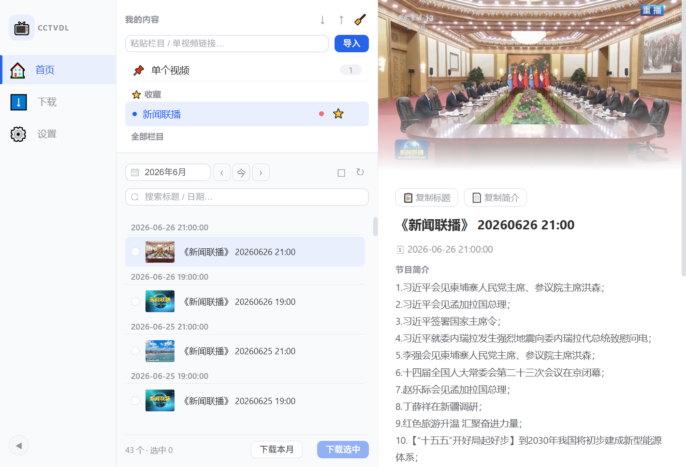
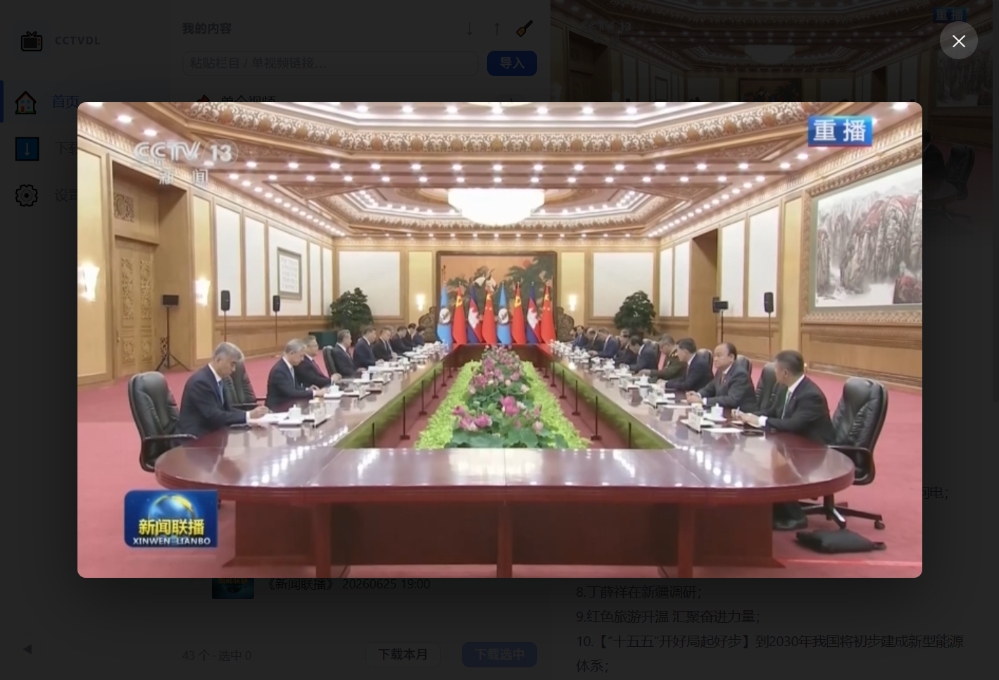
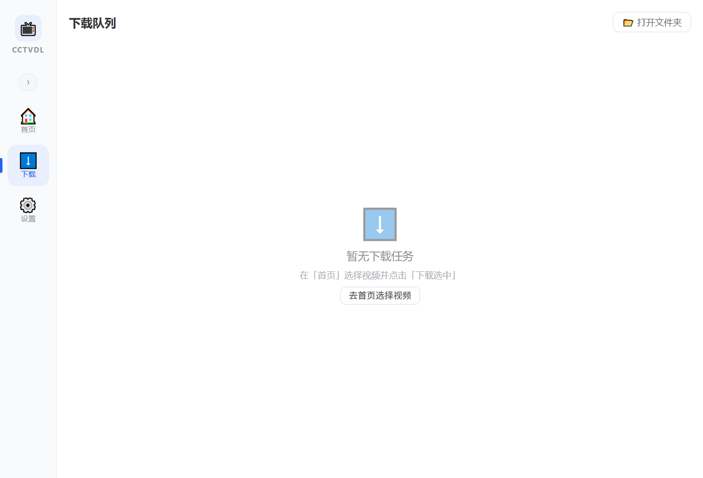
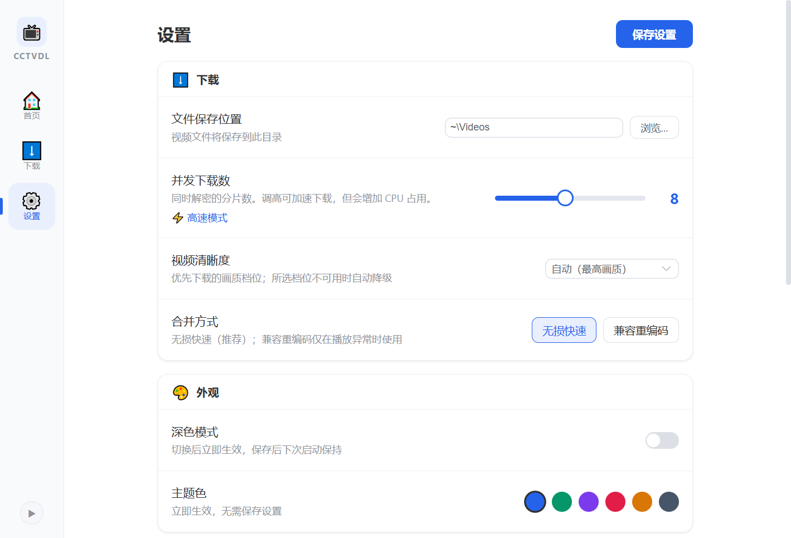
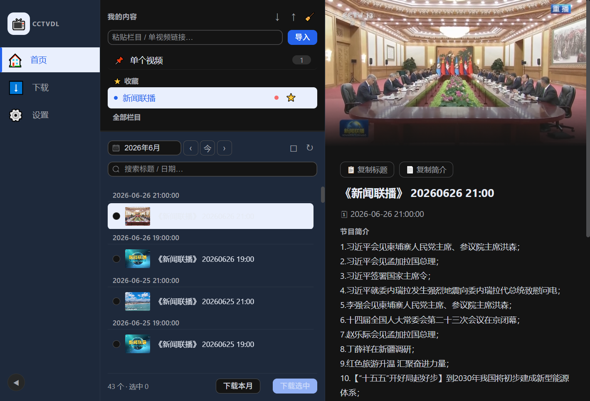

<h1 align="center">📺 cctvdl</h1>

将央视节目轻松下载到本地

  
  
  

cctvdl 让下载 CCTV 节目变得简单——粘贴链接 → 选择清晰度 → 批量下载，自动保存高清视频。开箱即用，支持 Windows / macOS / Linux。

  

## ✨ 功能特性

- **跨平台** — 支持 Windows / macOS / Linux
- **加密节目** — 自动处理央视加密视频，下载后即可正常观看
- **节目浏览** — 导入栏目、按月浏览、关键词搜索、封面预览、节目简介
- **栏目管理** — 收藏置顶常用栏目、悬停快捷删除、批量清空、导出备份
- **批量下载** — 多任务队列，实时显示速度、剩余时间与进度
- **清晰度选择** — 流畅 / 标清 / 高清 / 超清 / 蓝光（最高 1080p），或「自动」取最高；缺档自动降级
- **快速合并** — 自动合并为完整视频，画质无损、速度快
- **断点续传** — 失败 / 取消后保留进度，重试自动续传
- **下载历史** — 按视频去重，防止重复下载
- **现代化界面** — 垂直侧边栏、深色模式、主题色自定义、封面大图预览

## 🖼️ 界面一览

| 大图预览 | 下载管理 |
|:---:|:---:|
|  |  |
| **设置** | **深色模式** |
|  |  |

## 💻 系统要求

- **Windows** 10 及以上（64 位）
- **macOS** 11 Big Sur 及以上（Intel 与 Apple Silicon 均支持）
- **64 位主流 Linux 发行版**（通过 AppImage 运行）

## 📦 下载安装

前往 [Releases](../../releases) 页面，下载对应平台的安装包：

| 平台 | 安装包 |
|------|--------|
| Windows | `.exe` |
| macOS | `.dmg`（分别提供 Intel 与 Apple Silicon） |
| Linux | `.AppImage` |

> **开箱即用**：无需安装任何额外软件或环境，下载安装包即可使用。
>
> 安装包未做 Apple 开发者签名，首次打开时系统可能提示风险：macOS 在「系统设置 → 隐私与安全性」底部点「仍要打开」，Windows 在 SmartScreen 提示里点「更多信息 → 仍要运行」。详见 [常见问题](docs/FAQ.md)。

## 🚀 使用

1. 复制央视节目页 / 栏目页链接，粘贴到首页导入栏（或拖放到窗口）。
2. 点击左侧栏目加载视频列表，勾选要下载的视频。
3. 点击「下载选中」，在下载页查看进度、取消或重试。

完整图文步骤、设置说明与快捷键见 [使用指南](docs/USAGE.md)。

## ❓ 常见问题

安装、导入、下载、合并、日志等问题排查见 [常见问题](docs/FAQ.md)。

## 🤝 贡献

欢迎提交 Issue 与 Pull Request。开发环境、项目结构、提交规范与打包流程见 [贡献指南](CONTRIBUTING.md)；报告问题可使用内置的 [Issue 模板](.github/ISSUE_TEMPLATE)。

## 🙏 致谢

- [CCTVVideoDownloader](https://github.com/letr007/CCTVVideoDownloader) — 界面参考、接口参考
- [videodl](https://github.com/CharlesPikachu/videodl) — 解密方案

## 📄 许可

源代码以 [MIT](LICENSE) 许可发布。安装包内含的第三方组件（如 ffmpeg）适用其各自许可。

## ⚠️ 免责声明

本项目为个人开源项目，与中央广播电视总台（CCTV）无任何隶属或授权关系。

本工具仅供技术研究与个人学习使用。所有节目内容版权归中央广播电视总台所有，请勿将下载内容用于商业目的或二次分发。使用本工具所产生的一切后果由使用者自行承担。
