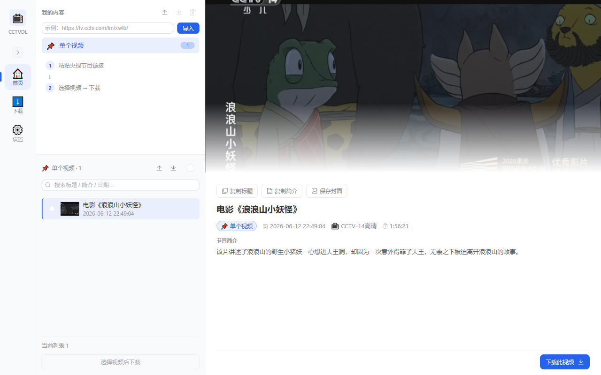
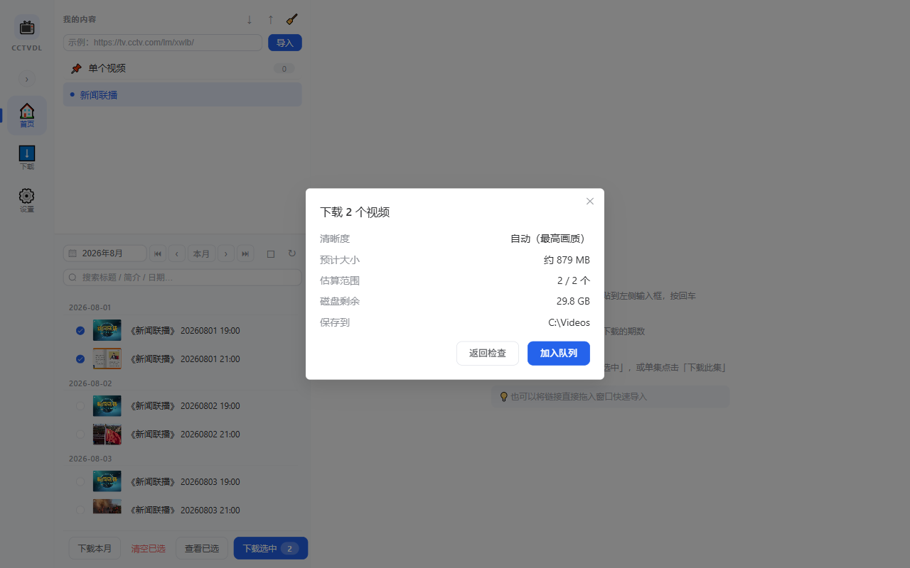
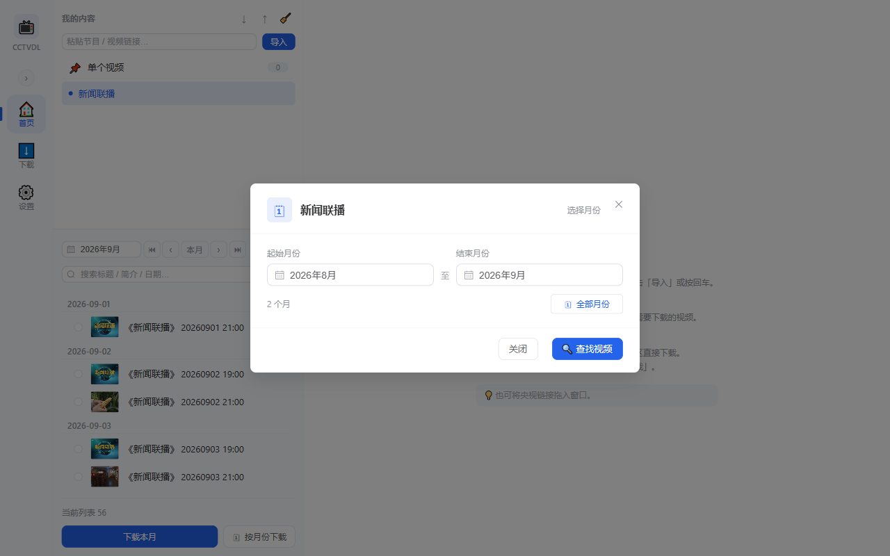
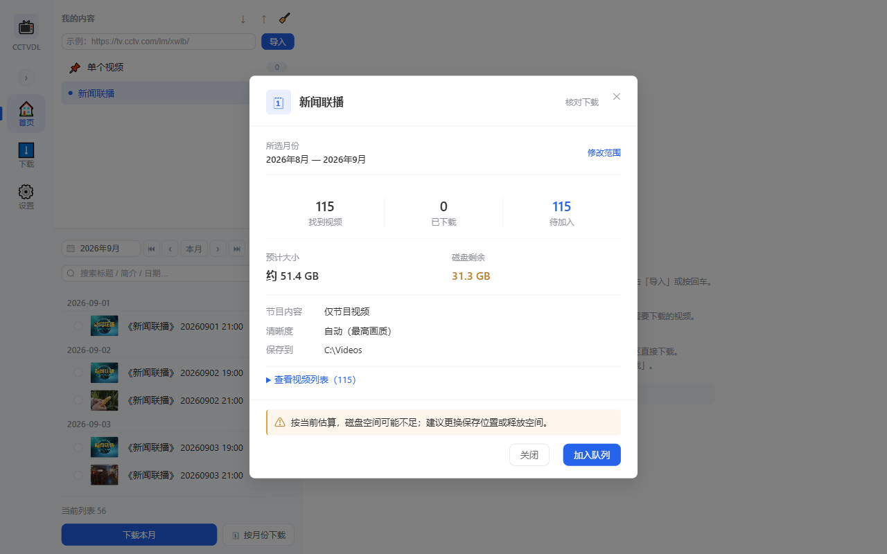
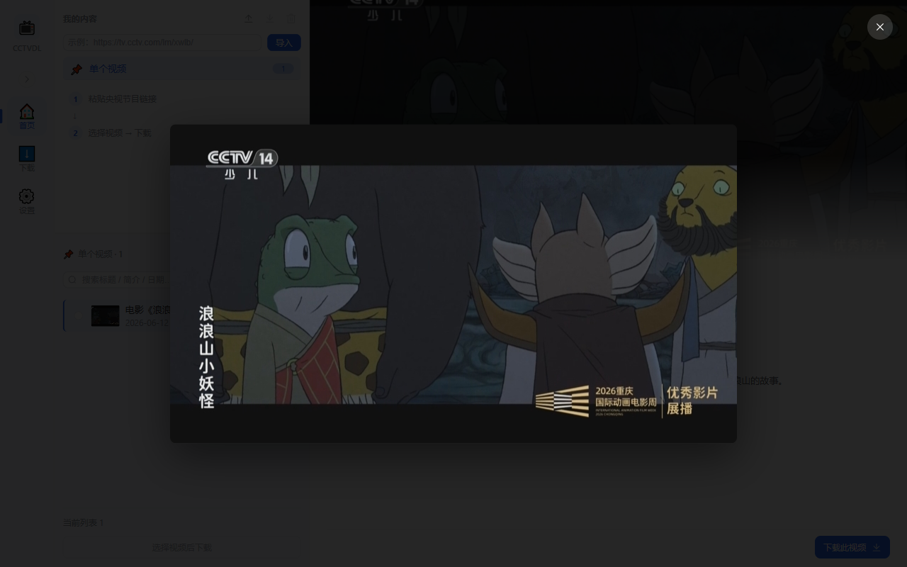
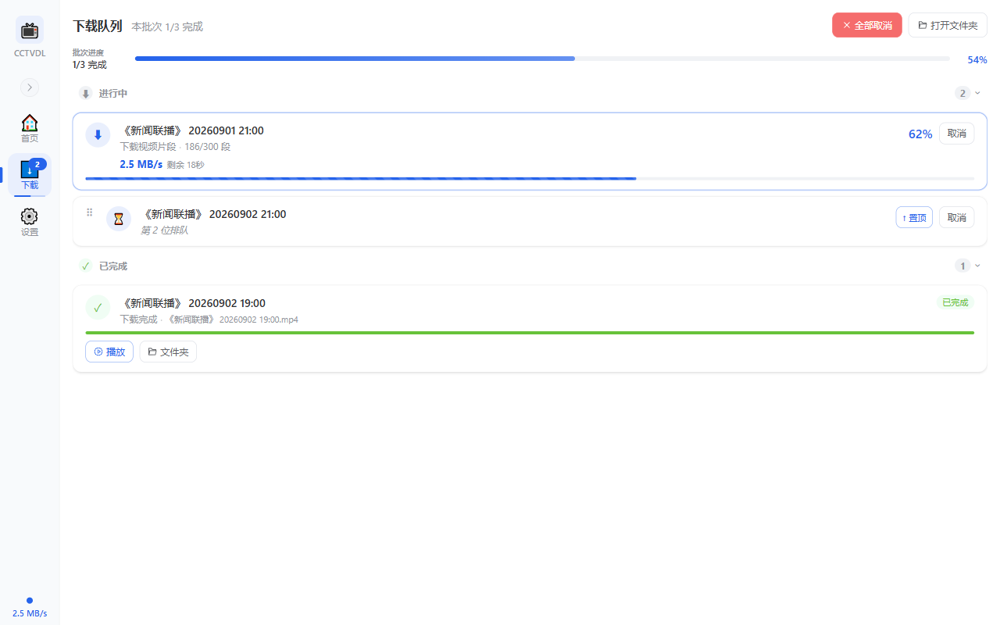
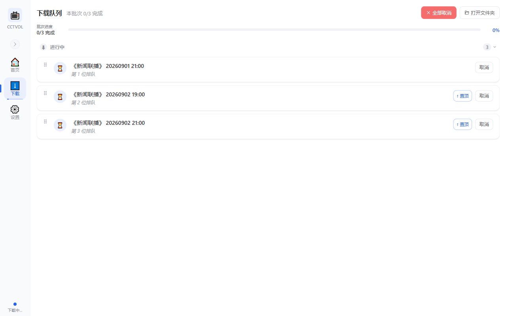
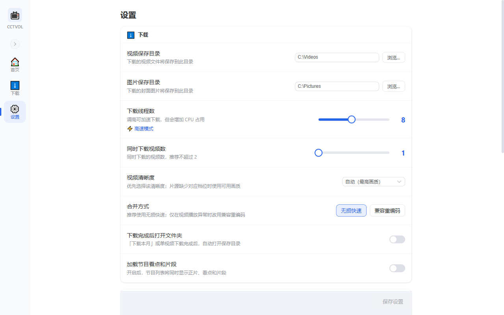
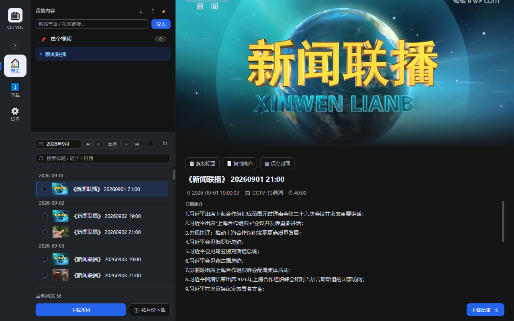

<h1 align="center">📺 cctvdl</h1>

跨平台央视视频下载器 · 开箱即用

  
  
  

粘贴央视栏目、专辑或视频链接，挑选内容，确认下载信息后加入队列。支持 Windows、macOS 和 Linux，安装包已包含下载所需组件。

  

## ✨ 功能特性

**📺 支持的链接**

- **栏目链接** — 按月份浏览和搜索节目；可下载本月、按起止月份批量下载，或跨月份和栏目挑选视频
- **历史栏目归档** — 识别央视中途更换栏目 ID 的长期节目；确认属于同一归档后，新旧内容合并为一个按月栏目
- **专辑链接** — 带有选集的电视剧、纪录片和 4K 节目可从节目首页或单集页导入；查看整组选集，并可切换从早到晚或从晚到早排列
- **具体视频页** — 能确认所属栏目或专辑时进入该节目；电影、新闻文章视频等独立内容进入「单个视频」集合

常规央视页面支持 `cctv.com`、`cctv.cn`、`cntv.cn` 及其历史频道子域名，包括 `v.cctv.com` 节目目录；程序会校验真实域名边界，不接受名称相似的第三方域名。

**📥 导入与管理**

- **快速导入** — 所有已支持的链接都可粘贴或拖放到窗口；也可开启剪贴板提示，复制后无需停留在首页
- **预览与整理** — 可查看标题、简介、封面、发布时间、频道和时长；长简介可独立滚动，标题、简介可一键复制，封面可保存到本地
- **可选扩展内容** — 开启「加载节目看点和片段」后，可在对应节目列表查看央视提供的短视频，并用标签区分
- **收藏与备份** — 常用内容可收藏置顶；可导出备份文件，也可随时导入恢复

**⬇️ 下载与队列**

- **画质选择** — 可自动选择片源的最高可用画质，也可设置流畅至蓝光的带宽档位；缺少所选档位时会回退到可用视频流，CCTV-16 优先尝试可用的明文 HLS
- **并行与续传** — 最多同时下载 3 个视频；失败或取消后可重试并复用已完成分片，未完成任务会在重启后恢复
- **下载前确认** — 单个和批量下载均显示清晰度、预计大小、磁盘剩余空间和保存位置；无法估算的部分和空间不足风险会明确提示
- **队列管理** — 跨月、跨栏目及单个视频的已选内容可统一入队；实时查看进度、调整顺序、取消或重试
- **按节目分文件夹** — 栏目和专辑分别存放；下载前可核对各个目标位置，「单个视频」直接保存到所选目录
- **完成后打开文件夹** — 开启后，队列结束时自动打开成功下载内容的保存位置，适用于所有下载方式
- **下载历史** — 自动记录已下载的视频，避免重复下载；支持搜索、重新下载、定位文件和单条删除

**🎨 界面与提醒**

- **界面与操作** — 垂直侧边栏（`Ctrl+\` 折叠）、深色模式、6 种主题色和封面大图预览
- **状态提醒** — 下载时系统托盘显示进度；新版本和收藏内容更新时显示红点；窗口隐藏或最小化时，点击可用的完成通知会打开下载页

## 🖼️ 界面一览

| 专辑浏览 | 单个视频下载 |
|:---:|:---:|
|  |  |
| **栏目片段** | **下载前确认** |
|  |  |
| **选择时间范围** | **核对扫描结果** |
|  |  |
| **封面大图预览** | **已选内容** |
|  |  |
| **下载管理** | **任务排序** |
|  |  |
| **设置** | **深色模式** |
|  |  |

## 💻 系统要求

- **Windows** 10 及以上（x64，暂不提供 arm64 安装包）
- **macOS** 11 Big Sur 及以上（Intel 与 Apple Silicon）
- **64 位主流 Linux 发行版**（x64 与 arm64，通过 AppImage 运行）

## 📦 下载安装

前往 [Releases](../../releases) 页面，根据系统与架构选择安装包：

| 系统与架构 | 文件名结尾 |
|------------|------------|
| Windows x64 | `x64.exe` |
| macOS Intel | `x64.dmg` |
| macOS Apple Silicon | `arm64.dmg` |
| Linux x64 | `x64.AppImage` |
| Linux arm64 | `arm64.AppImage` |

> 安装包已包含下载所需组件，无需额外安装软件，下载安装包即可使用。
>
> 安装包未做 Apple 开发者签名，首次打开时系统可能提示风险：macOS 在「系统设置 → 隐私与安全性」底部点「仍要打开」，Windows 在 SmartScreen 提示里点「更多信息 → 仍要运行」。详见 [常见问题](docs/FAQ.md)。

## 🚀 使用

1. 复制支持的央视页面链接，粘贴到首页导入栏，或拖放到窗口。
2. 打开导入的栏目、专辑或「单个视频」，找到要下载的内容。
3. 勾选后点「下载选中」，也可下载当前月份、按时间范围下载栏目，或下载预览中的单条视频；核对信息后加入队列。
4. 在下载页查看进度、调整顺序、取消或重试。

完整图文步骤、设置说明与快捷键见 [使用指南](docs/USAGE.md)。

## ❓ 常见问题

安装、导入、下载、合并、日志等问题排查见 [常见问题](docs/FAQ.md)。

## 🤝 贡献

欢迎提交 Issue 与 Pull Request。开发环境、项目结构、提交规范与打包流程见 [贡献指南](CONTRIBUTING.md)；报告问题可使用内置的 [Issue 模板](.github/ISSUE_TEMPLATE)。

## 🙏 致谢

- [CCTVVideoDownloader](https://github.com/letr007/CCTVVideoDownloader) — 界面参考、接口参考
- [videodl](https://github.com/CharlesPikachu/videodl) — 解密方案

## 📄 许可

源代码以 [MIT](LICENSE) 许可发布。安装包内含的第三方组件（如 ffmpeg）适用其各自许可。

## ⚠️ 免责声明

本项目为个人开源项目，与中央广播电视总台（CCTV）无任何隶属或授权关系。

本工具仅供技术研究与个人学习使用。所有节目内容版权归中央广播电视总台所有，请勿将下载内容用于商业目的或二次分发。使用本工具所产生的一切后果由使用者自行承担。
