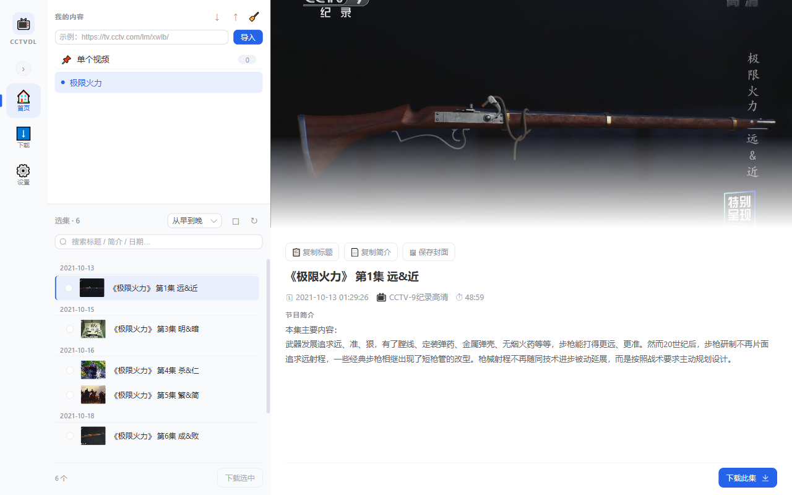
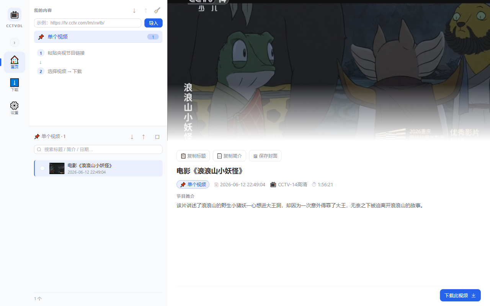
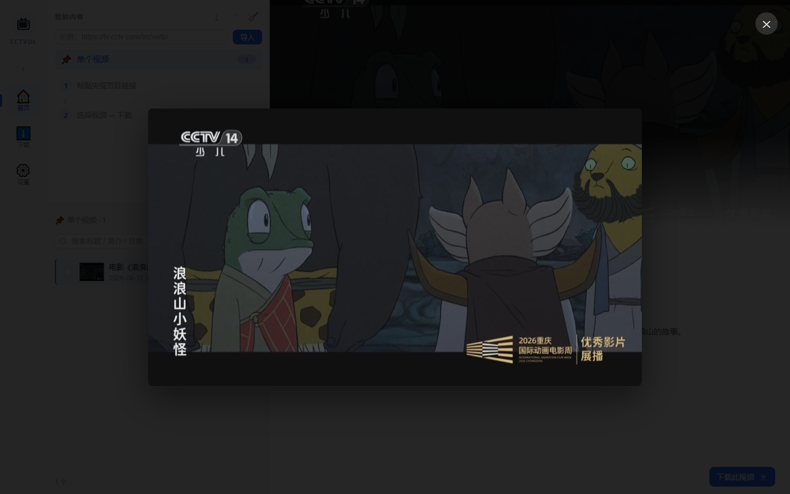
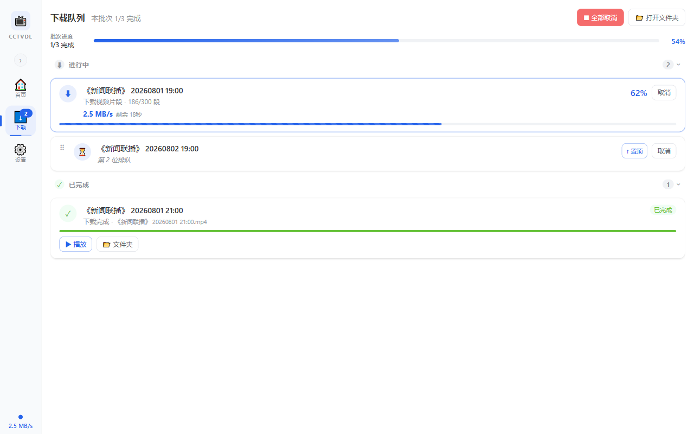
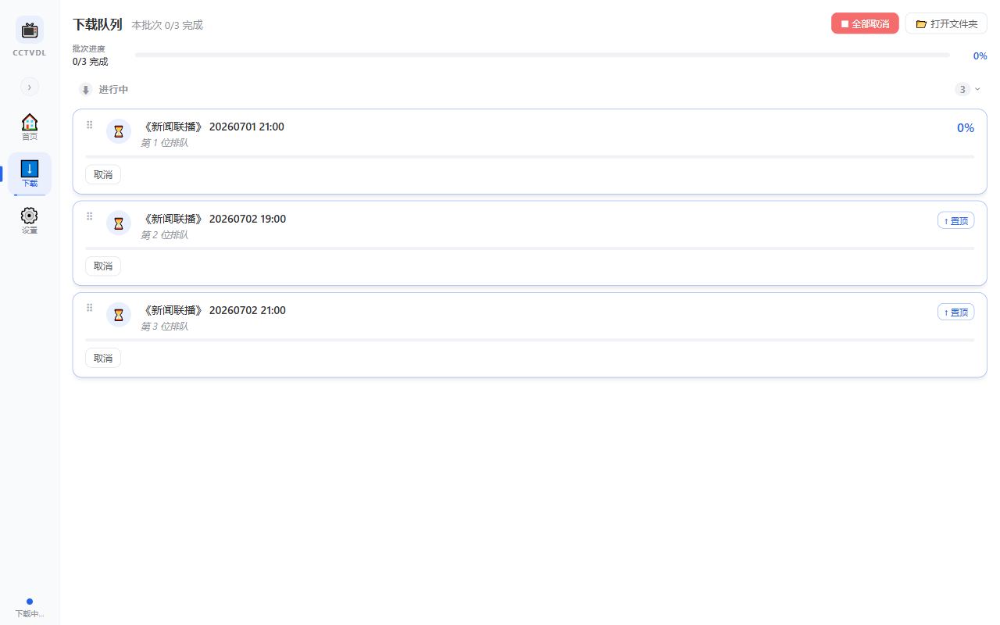
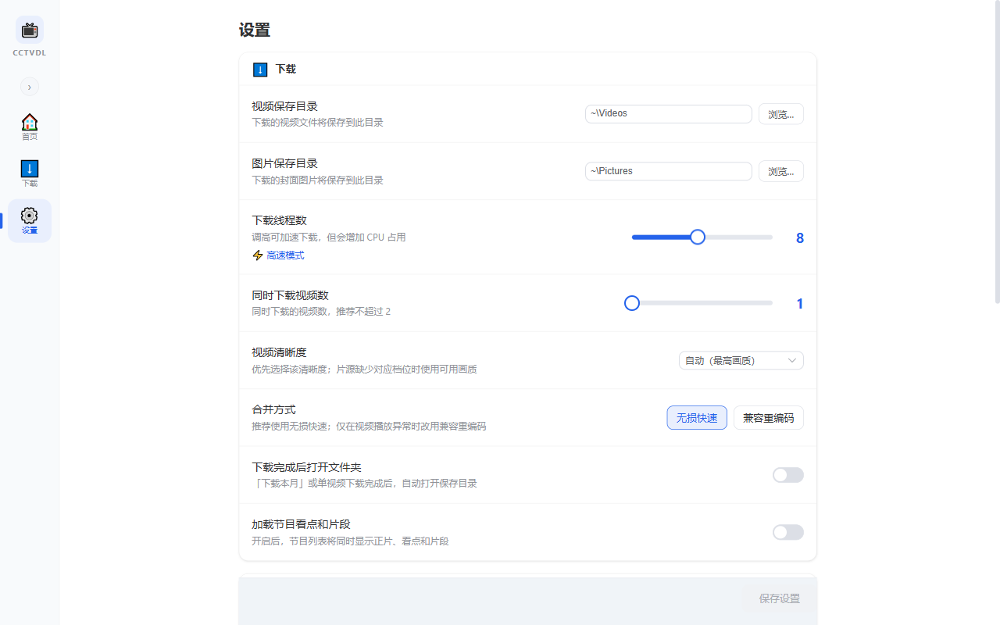
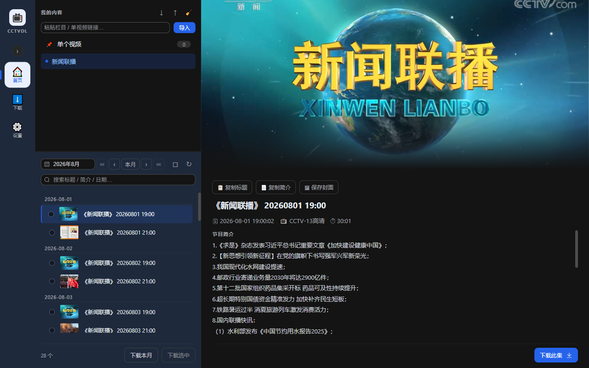

# 使用指南

安装请看 [README](../README.md)，遇到异常可查 [常见问题](FAQ.md)。

cctvdl 的使用很简单：**导入央视链接 → 找到节目 → 选择要下载的视频 → 在下载页查看结果**。下载安装包后即可使用，无需额外准备工具。

## 先了解：可以导入什么

把浏览器地址栏中的完整链接粘贴到首页输入框，按 Enter 或点击「导入」；也可以直接把链接拖到窗口中。

- **栏目**：例如新闻联播。按月份浏览，可下载本月全部内容或选择多期下载。央视中途更换过栏目 ID 的长期节目会合并到同一个栏目。
- **节目集**：电视剧、纪录片、4K 节目等。粘贴节目首页或任意一集，都会显示整部节目的选集。
- **单个视频**：电影、新闻文章视频、独立导视和精彩片段等。独立内容进入左侧「📌 单个视频」集合；能识别所属节目集的片段会打开对应节目。
- **央视新闻移动端视频**：支持央视新闻 App 或移动端分享出的可播放视频页；页面包含多条视频时会一并加入「单个视频」。

也支持 `v.cctv.com` 的节目目录链接。开启设置中的「加载节目看点和片段」后，节目列表将同时显示正片、看点和片段，并用不同颜色的标签区分。该历史目录目前没有对应的看点和片段接口。

导入过的栏目、节目集和单个视频会保存在本机，下次打开仍在。已经导入的同一内容不会重复添加。

## 1. 浏览内容

### 栏目：按月份找节目

点击左侧栏目名称，选择月份后即可浏览该月节目。列表按从早到晚排列；可用月份旁的 `‹` / `›` 切换相邻月份，或用 `⏮` / `⏭` 一键定位最早 / 最新节目月份。停更栏目或跨度很长的历史栏目不必逐月查找。也可在搜索框按标题、简介或日期筛选。

部分历史节目在播出期间更换过央视栏目 ID。遇到这类内容时，程序会使用稳定的节目归档作为数据源：无论粘贴节目概览、变更前的一期还是变更后的一期，都会进入同一个按月栏目，新旧内容不会被拆成两项。

- 「下载本月」会下载当前栏目、当前月份的全部视频。
- 勾选框用于挑选若干期；它不受搜索结果或月份切换限制，可跨月份、跨栏目累积选择。
- 切换月份会复用短期缓存；点击刷新按钮或按 `F5` 会重新读取央视列表。
- 行尾的 ✓ 表示该视频已下载。

### 节目集：从节目首页或任意一集进入

节目集不需要选择月份。打开后会逐页加载选集，并即时显示已经加载的数量；选集较多时不必等待所有内容加载完成。

可在列表上方切换「正序（最早在前）」和「倒序（最新在前）」。节目集不显示「下载本月」，可下载单集或勾选后批量下载。

### 单个视频：统一放进一个集合

导入独立视频后，点击左侧「📌 单个视频」即可查看。这里和栏目、节目集一样支持预览、勾选和批量下载；点击预览区域的「下载此视频」可以直接下载当前视频。

单个视频集合可用标题栏的 ↑ / ↓ 导出或导入备份文件；悬停视频行后点击 🗑 可将该视频从集合移除。

### 收藏、删除与备份

把鼠标移到左侧栏目或节目集上：

- 点 ⭐ 将其收藏并置顶；再次点击取消收藏。
- 点 🗑 删除这一项。也可右键，或选中后按 `Delete`（macOS 可用 `Delete` 或 `Fn+Delete`）。
- 「我的内容」标题右侧的 ↓ / ↑ 可导入、导出栏目与节目集的备份文件；🧹 用于清空全部内容，会先要求确认。

## 2. 预览、选择和整理

点击一条视频，右侧会显示封面、标题、简介、发布时间、频道和时长（以央视接口实际提供为准）。可直接复制标题或简介，也可把封面保存到本地；点击封面会打开大图预览。

| 封面大图预览 | 已选内容 |
|:---:|:---:|
|  |  |

勾选一条或多条视频后，底部会显示已选数量：

- 「查看已选」会列出所有已选视频；每行右侧的 `×` 是**移除该视频**，不是错误提示。
- 「清空已选」会取消全部勾选。
- `Ctrl+A`（macOS `⌘A`）可全选或取消全选当前筛选结果。

切换到「单个视频」集合会清空此前栏目、节目集中的勾选，避免把不同来源的临时选择混在一起。

## 3. 开始下载

### 下载前的三个选择

在「设置」页先确认：保存目录、视频清晰度、同时下载视频数。通常保留默认值就可以。

1. 勾选视频后点击「下载选中」，或在预览区点击「下载此集 / 下载此视频」。
2. 普通栏目也可以点击「下载本月」。
3. 批量下载前会显示数量、清晰度和保存位置；确认后才会进入队列。

选择清晰度后，程序会优先下载该档位可用的最佳画质。各档位对应的分辨率和最高码率如下：

| 清晰度 | 分辨率 | 最高码率 |
|---|---:|---:|
| 流畅（270p） | 480×270 | 460.8 Kbps |
| 标清（360p） | 640×360 | 870.4 Kbps |
| 高清（720p） | 1280×720 | 1.2288 Mbps |
| 超清（720p） | 1280×720 | 2.048 Mbps |
| 蓝光（1080p） | 1920×1080 | 4.096 Mbps |
| 自动 | — | 最高可用 |

央视片源不一定提供所有档位：普通节目通常最高为 720p，部分频道可提供 1080p，老节目可能只有流畅和标清。如果所选档位不存在，程序会从片源实际提供的画质中选择可下载的一路，因此最终画质可能与设置不同。

CCTV-16 会优先尝试与所选清晰度匹配的明文 HLS，以规避部分加密片源可能出现的轻微损坏；所有明文档位都不可用时，会自动回退到普通加密下载链路。两种下载方式都支持并发、重试、取消和断点续传。

画质选择的具体规则

程序会在不超过所选档位最高码率的视频流中，优先选择分辨率最高、同分辨率下码率最高的一路。如果所有视频流都超过所选档位，则使用片源中码率最低的一路，避免下载失败；这种情况下，实际画质可能高于设置。

央视新闻移动端视频使用页面自己的画质列表，对应最高码率为：流畅 600 Kbps、标清 1 Mbps、高清 2 Mbps、超清 3.5 Mbps；蓝光与自动不限制码率。选择和兜底规则相同，实际分辨率以页面提供的画质为准。

## 4. 在下载页管理队列

下载页分为「进行中」「已完成」「失败 / 取消」三组。新加入的任务会接在已有队列后，不会打断正在下载的内容。

| 下载进度 | 排队与顺序 |
|:---:|:---:|
|  |  |

- **进行中**：查看进度、速度和剩余时间；可取消单个任务，或使用「全部取消」。
- **排队中**：拖动 `⠿` 手柄调整顺序，或点「↑ 置顶」移到队首。
- **已完成**：可用「▶ 播放」验证视频，或点「📂 文件夹」在文件管理器中定位它。
- **失败 / 取消**：点「↺ 重试」继续下载；已经下载的部分会保留，不必从头开始。意外退出应用后，未完成任务也会在下次启动时恢复。
- 「清除已结束」只会移除已完成、失败和取消的卡片，不会删除视频文件或下载历史。

下载过的视频会记录到「下载历史」，再次加入时会自动跳过；若确实需要再下载，到「设置 → 下载历史」中点「↺ 重新下载」。

## 5. 设置建议

| 设置 | 日常建议 |
|---|---|
| 视频保存目录 | 选一个有写权限、空间充足的目录。 |
| 图片保存目录 | 保存封面时使用；不设置时使用系统默认图片目录。 |
| 下载线程数 | 默认 8；网络不稳定或电脑负载高时可调低。 |
| 同时下载视频数 | 默认 1；一般可设为 2，网络和性能都较好时再尝试 3。 |
| 合并方式 | 保持「无损快速」；只有下载完成后播放异常时才改为「兼容重编码」。 |
| 下载完成后打开文件夹 | 下载本月或直接下载单个视频后，自动打开保存目录。 |
| 加载节目看点和片段 | 默认关闭；开启后，节目列表将同时显示正片、看点和片段。 |
| 剪贴板自动导入 | 默认关闭；复制支持的链接时询问是否导入。 |
| 日志级别 | 日常保持「日常」；排查问题时改为「调试」。 |
| 下载历史 | 查看已下载内容、重新下载、定位文件或删除记录。 |

剪贴板自动导入开启并保存后会立即检查一次；之后在首页、下载页或设置页复制支持的央视链接，都会弹出导入提示。

| 设置 | 深色模式 |
|:---:|:---:|
|  |  |

主题色和深色模式会立即生效，并在下次打开时保留。左侧下载图标会显示任务数量与迷你进度条；侧边栏底部会显示实时总速度，无需停留在下载页也能查看状态。

## 6. 提醒与窗口

- 下载时可以最小化或隐藏窗口，系统托盘仍会显示下载状态；单击托盘图标可重新显示窗口。
- 有新版本或收藏内容出现更新时，对应位置会显示红点提醒；点击后即可查看。
- 窗口大小和位置会自动记住。再次打开已在运行的 cctvdl 时，程序会直接显示原窗口，不会重复启动。
- 点击左上角的 📺 图标可查看版本信息；反馈问题时附上版本号会更便于排查。

## 快捷键

| 快捷键 | 功能 |
|---|---|
| `1` / `2` / `3` | 切换首页 / 下载 / 设置 |
| `F5` | 刷新当前栏目的视频列表 |
| `Ctrl+A`（macOS `⌘A`） | 全选 / 取消全选当前筛选结果 |
| `Ctrl+\`（macOS `⌘\`） | 折叠 / 展开左侧边栏 |
| `Delete` | 删除当前选中的栏目或节目集（输入框内不会触发） |
| `Esc` | 关闭封面大图、关于等弹窗 |

## 需要帮助？

- 导入失败、列表为空、下载被跳过：先看 [常见问题](FAQ.md)。
- 提交问题时，请提供应用版本、系统版本、复现步骤和日志；日志级别设为「调试」后可获得更多信息。
